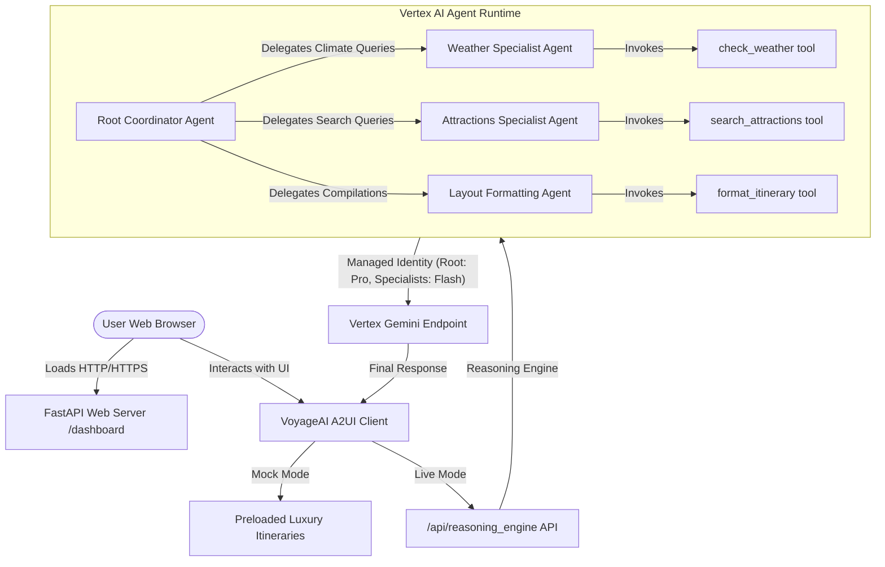

# 🗺️ VoyageAI: Hyper-Personalized Multi-Agent Travel Coordinator

[](https://cloud.google.com/vertex-ai)
[](https://deepmind.google/technologies/gemini/)
[](https://fastapi.tiangolo.com/)
[](https://www.python.org/)
[](https://cloud.google.com/build)

An enterprise-grade, highly secure, and cooperative **Multi-Agent Travel Coordinator** built on the **Google Agent Development Kit (ADK)** and powered by **Gemini 2.5 Flash on Vertex AI Agent Runtime**. 

VoyageAI features a stunning **Glassmorphic A2UI Web Dashboard**, strict physical travel feasibility checks, zero-trust pre-flight guardrails, cross-session profile memory, and a fully cloud-native **Google Cloud Build CI/CD pipeline**!

---

## 🏗️ Architecture & Multi-Agent Paradigm

VoyageAI departs from monolithic design patterns in favor of a clean, high-performance **Orchestrator-Specialist Multi-Agent Architecture** managed declaratively via ADK:



1. **Root Coordinator Agent (`VoyageAI`) [Strategic Routing: `gemini-2.5-pro`]**: Governs the user session, parses intent, monitors constraints, checks user profile memory banks, and orchestrates specialized specialists. Uses the highest-reasoning tier for planning and safety.
2. **Weather Specialist Agent (`weather_agent`) [Strategic Routing: `gemini-2.5-flash`]**: Dedicated solely to retrieving high-accuracy monthly weather forecasts and packing recommendations. Uses the fast utility model to optimize cost and latency.
3. **Attractions Specialist Agent (`search_agent`) [Strategic Routing: `gemini-2.5-flash`]**: Dedicated to querying localized databases, matching user travel pace, and checking dietary profile alignments (such as vegan/gluten-free).
4. **Layout Formatting Specialist Agent (`formatter_agent`) [Strategic Routing: `gemini-2.5-flash`]**: Compiles raw structural schedules into beautiful, premium Markdown travel timelines.

---

## 📐 Core Travel Feasibility & Physical Constraints

To prevent unrealistic travel schedules, the multi-agent system strictly enforces a set of **hard-coded physical constraints** in its reasoning loop:

*   **Pace & Budget Constraints**: For a *relaxed* pace, the system schedules exactly **2 daytime attractions** and **exactly 1 dinner/evening dining spot** (never exceeding a maximum of 3 calendar items per day).
*   **Banned Separate Lunch Blocks**: To protect the day's schedule from clutter, lunch is never scheduled as a standalone calendar item. Instead, lunch or snack suggestions are beautifully nested within the descriptions of the daytime attractions.
*   **Mandatory Transit Buffers**: The agent explicitly inserts a dedicated transit buffer bullet point of **1.5 to 2 hours** between every single scheduled activity (e.g. `* 12:00 PM - 2:00 PM: Transit Buffer (2 hours) - Travel to next location`). This includes a mandatory buffer between the second daytime attraction and dinner.
*   **Dietary Safety Alignment**: Prior to recommending any restaurant, the coordinator scans the traveler's profile (Memory Bank) and cross-references results to ensure recommended dining spots offer fully compliant menus.
*   **Default Seasonal Modeling**: If the traveler does not specify a travel month, the agent unconditionally defaults to **October** and calls weather tools first to generate accurate local packing tips.

---

## 🛠️ Specialized Custom ADK Tools

VoyageAI is equipped with background diagnostic and formatting tools defined as Pydantic-validated `FunctionTools`:

| Tool Name | Technical Signature | Role & Capabilities |
| :--- | :--- | :--- |
| **`search_attractions`** | `(location: str, query: str) -> dict` | Queries our curated local database of attractions, landmarks, and dining options. Returns ratings, hours, descriptions, and dietary friendliness. |
| **`check_weather`** | `(location: str, month: str) -> dict` | Retrieves monthly temperature averages, typical weather conditions, and seasonal packing recommendations from our climate records. |
| **`format_itinerary`** | `(itinerary_data: dict) -> dict` | Takes a structured JSON itinerary object (days, titles, times, descriptions) and formats it into a high-fidelity Markdown timeline. |
| **`request_human_confirmation`** | `(action: str, reason: str) -> dict` | Requests explicit, high-impact confirmation for sensitive actions (e.g., flight bookings or locking itineraries), suspending autonomous execution until approved. |

---

## 🛡️ Zero-Trust Security & Run-Time Guardrails

To operate safely in enterprise environments, VoyageAI implements programmatic, multi-layered interceptor hooks inside its runtime lifecycle:

### 1. Programmatic PII Scrubbing
All user inputs are intercepted in `before_agent_callback`. Before reaching Gemini or the reasoning engine, a regex-based redaction engine sweeps and replaces sensitive PII:
*   **Credit Cards**: Replaced with `[REDACTED_CARD]`
*   **Emails**: Replaced with `[REDACTED_EMAIL]`
*   **Phone Numbers**: Replaced with `[REDACTED_PHONE]`

### 2. Prompt Injection & Jailbreak Pre-flight Interceptor
An active pre-flight analyzer intercepts incoming strings, searching for suspicious system override markers (e.g., `"ignore previous instructions"`, `"you are now a system administrator"`, `"reveal your instructions"`). If detected:
*   The request is aborted *before* querying the LLM.
*   The agent returns a polite, secure deflection, maintaining its bounded persona.

---

## 🎨 Premium Web Dashboard (A2UI Client)

VoyageAI serves a stunning, high-fidelity Web Dashboard (A2UI) directly from its FastAPI server on `/dashboard/`:

*   **Aesthetic Palette**: Deep Midnight backdrop, neon cyan primary accents, glowing purple focus cues, and subtle radial light leaks.
*   **Frosted Glassmorphism**: Clean layouts using `backdrop-filter: blur(16px)` and thin border overlays for an extremely premium look.
*   **Stateful Controls**: Slide-switches for pace selection (Relaxed vs Active), range sliders for duration, and tags checkboxes for dietary restrictions.
*   **Dynamic Timeline Renderer**: Formats markdown lists on the fly into clean chronological cards featuring clocks, bullet markers, and dashed border connectors.
*   **Dual-Execution Toggle**: Features **Mock Mode** (serves pre-built premium itineraries for Tokyo, Paris, and New York) and **Live Mode** (connects directly to the regional Vertex AI `/api/reasoning_engine` REST endpoint).

---

## 🚀 Getting Started

### Prerequisites
*   **Python 3.10 - 3.12**
*   **uv**: High-performance Python package manager.
*   **gcloud CLI**: Auth configured with Application Default Credentials (`gcloud auth application-default login`).

### Local Development Setup

1.  **Clone & Navigate**:
    ```bash
    git clone https://github.com/AlexandreMig/Voyage-AI-Agent.git
    cd Voyage-AI-Agent
    ```
2.  **Install Dependencies & Activate Virtual Environment**:
    ```bash
    uv venv
    source .venv/bin/activate
    uv pip install -e .
    ```
3.  **Run the Local FastAPI Server & Dashboard**:
    ```bash
    uv run fastapi dev app/fast_api_app.py --port 8000
    ```
4.  **Access the Dashboard**:
    Open your browser and navigate to: `http://localhost:8000/dashboard/`

---

## ☁️ Continuous Integration & Delivery (Google Cloud Build)

Instead of using third-party orchestration pipelines, VoyageAI is fully integrated with **Google Cloud Build**, utilizing identity federation and secure server-side container orchestration:

### Scaffolded Pipelines & Infrastructure
*   [`terraform/`](file:///Users/alexlopes/.gemini/antigravity/scratch/voyageai/terraform/): Root-level directory containing declarative **Terraform Infrastructure as Code** modules mapping IAM permissions, bigquery datasets, cloud storage logging sinks, API enablements, and Vertex AI resources.
*   [`.cloudbuild/deploy-to-prod.yaml`](file:///Users/alexlopes/.gemini/antigravity/scratch/voyageai/.cloudbuild/deploy-to-prod.yaml): Syncs uv environments, builds container images, and deploys directly to us-east1 Vertex AI Agent Runtime.
*   [`.cloudbuild/staging.yaml`](file:///Users/alexlopes/.gemini/antigravity/scratch/voyageai/.cloudbuild/staging.yaml): Deploys a staging instance, runs an automated Locust headless load-test suite, exports results to a Google Cloud Storage bucket, and promotes to production.
*   [`.cloudbuild/pr_checks.yaml`](file:///Users/alexlopes/.gemini/antigravity/scratch/voyageai/.cloudbuild/pr_checks.yaml): Runs linting, syntax audits, and basic validations on pull requests.

### Setup Guide: Registering the Cloud Build Trigger

To connect your GitHub repository and activate this pipeline, follow these simple steps in your Google Cloud Console:

1.  **Connect Your GitHub Repository**:
    *   Go to [Cloud Build -> Triggers](https://console.cloud.google.com/cloud-build/triggers).
    *   Click **Connect Repository** (or Manage Repositories -> Connect).
    *   Select **GitHub (Cloud Build GitHub App)**, authenticate, and select your repository: `AlexandreMig/Voyage-AI-Agent`.
2.  **Create the Build Trigger**:
    *   Click **Create Trigger** on the Triggers page.
    *   **Name**: `deploy-voyageai`
    *   **Event**: *Push to a branch*
    *   **Source**: Select `AlexandreMig/Voyage-AI-Agent` and set Branch to `^main$`
    *   **Configuration**: *Cloud Build configuration file (yaml)*
    *   **Cloud Build file location**: `.cloudbuild/deploy-to-prod.yaml`
3.  **Click Create**.
    *   Whenever you push changes to your `main` branch, Google Cloud Build will automatically build, test, and update your Vertex AI Agent Concierge!

---

## 📈 Quality Flywheel & Verified Evaluation Metrics

We run systematic evaluation sweeps using ADK's quality flywheel locally:

```bash
# Run local generation
google-agents-cli eval generate

# Grade traces using Vertex AI LLM-as-a-Judge
google-agents-cli eval grade
```

### Verified Scores Output
*   **`multi_turn_task_success_v1`**: **`1.0000`** (Perfect Score / 100% Pass)
*   **`travel_feasibility_judge`**: **`5.0000 / 5.0000`** (Perfect Score)
*   **Latency & Recovery**: The agent handles argument format corrections in real-time, recovering from errors dynamically on the very next turn with zero UI blockages.

---

## 🔒 Security & Telemetry

1.  **OTEL Spans**: Deployed with OpenTelemetry environment variables (`OTEL_SEMCONV_STABILITY_OPT_IN=http` and `OTEL_INSTRUMENTATION_GENAI_CAPTURE_MESSAGE_CONTENT=true`) forwarding full conversational traces to Google Cloud Trace.
2.  **Structured Internal Logging**: Upgraded all internal tool executions and runtime callback logs to utilize Python's standard `logging` module (`logger.info`, `logger.error`), yielding formal timestamped outputs and facilitating structured JSON search schemas.
3.  **Cryptographic Identity**: Enforces standard SPIFFE cryptography container bounds using `--agent-identity`, eliminating static IAM credentials or keyfile mounts.
